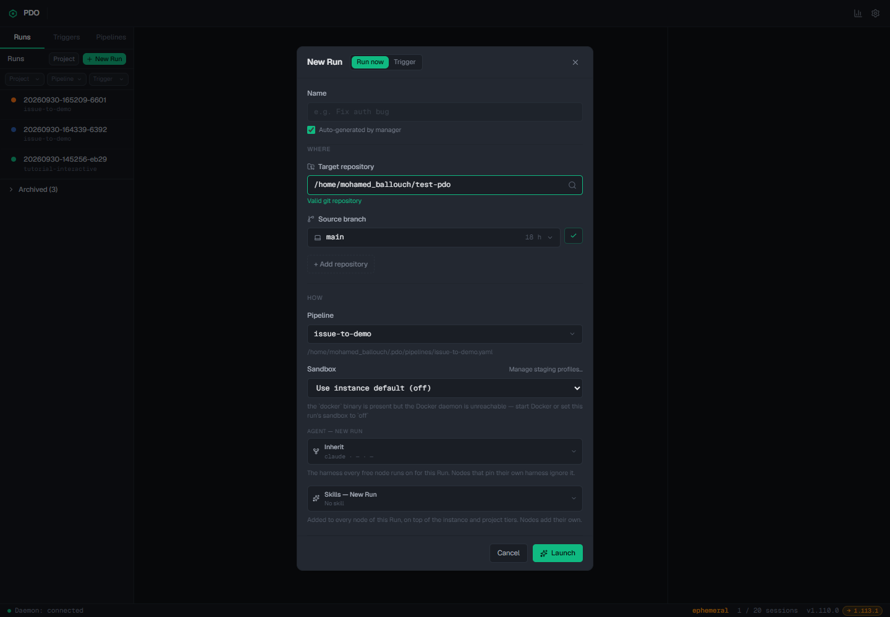
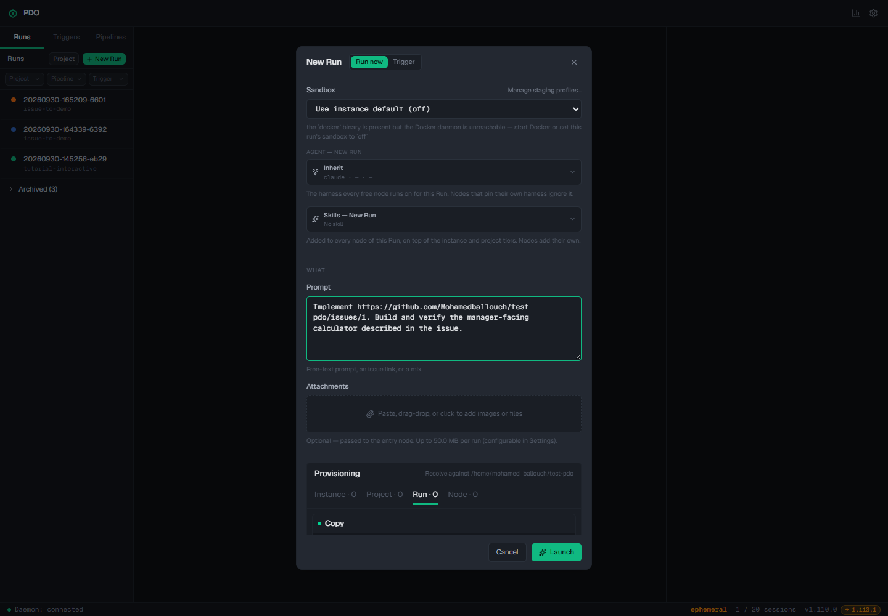
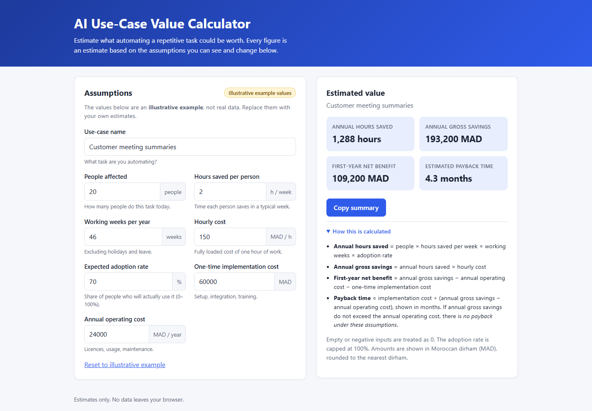

# 3. From a GitHub issue to a reviewed PDO run

This is the functional walkthrough for [issue #1: AI use-case value calculator](https://github.com/Mohamedballouch/test-pdo/issues/1). The issue asks for a manager-facing app that estimates hours saved, annual savings, first-year net benefit, and payback. The completed PDO run **20260930-160812-5f4caf7** created the calculator on a run branch. The GitHub issue and the source branch are separate until someone publishes the branch or opens a pull request.

[Watch the short PDO UI walkthrough](assets/pdo-ui-walkthrough.webm). It shows the actual pipeline, completed node output, and a filled New Run form. The recording **does not launch** another run or show secret credentials.
For a playable local page with **both videos**, open [the PDO video page](http://localhost:5172/pages/pdo-guide/videos.html). It is already mounted on the PDO instance used here. On another checkout, mount the docs once from an Ubuntu terminal:

~~~bash
cd ~/test-pdo
pdo page mount pdo-guide "$PWD/docs"
~~~

Then open the same local URL. GitHub's file view may offer the WebM files as downloads rather than previewing them; the local page plays them in the browser.

## 1. Create or choose a ticket

For a new request, open the GitHub repository's **Issues → New issue** screen. Write a goal, the user flow, acceptance criteria, and what is out of scope. Clear acceptance criteria let the Verify feature node give a meaningful pass/fail verdict. [Issue #1](https://github.com/Mohamedballouch/test-pdo/issues/1) is a complete example.

You can read the same ticket from Ubuntu:

~~~bash
gh issue view 1 --repo Mohamedballouch/test-pdo
~~~

If that fails, check **gh auth status** and **git remote -v** from the clone before launching PDO.

## 2. Point PDO at the clone

In [PDO](http://localhost:5172), select **Runs → New Run**. In **Target repository**, enter or choose:

~~~
/home/mohamed_ballouch/test-pdo
~~~

PDO validates that it is a Git repository. This local path is how PDO finds the code and its Git remote. It is not a GitHub account connection screen. If you use a different Ubuntu user, get the correct path by running **pwd** in the cloned repository. Do not paste a Windows C:\ path into an Ubuntu-run PDO instance.

Optionally select **Runs → Project** to group repositories. The Project dialog lists local member repositories; assigning the clone to a project can apply a common agent setting to its runs. It does not create a GitHub OAuth connection.

Choose **Source branch: main** for a fresh request unless you deliberately need another starting point. On this machine, PDO's New Run form shows **main** even while the working checkout is on a run branch; read the Source branch field rather than assuming it uses the currently checked-out branch. PDO creates a separate run branch/worktree for the work.

## 3. Select the pipeline and issue

Under **How → Pipeline**, choose **issue-to-demo**. Under **Agent — New Run**, keep inherited **claude**. For this WSL setup, leave **Sandbox** at the instance default **off**. Under **What → Prompt**, enter a specific request with the full ticket URL:

~~~
Implement https://github.com/Mohamedballouch/test-pdo/issues/1. Build and verify the manager-facing calculator described in the issue.
~~~

The first node reads the ticket through **gh**. A URL in this prompt is enough for this pipeline; the pipeline has explicit instructions to fetch the issue body and comments. PDO does not watch all GitHub issues automatically. To run when a ticket changes, you would need a configured Trigger or another external automation.

Check the target path, branch, pipeline, and prompt. Select **Launch** once. The image below shows the filled prompt used for this walkthrough; it was cancelled after recording to avoid a duplicate run.

## 4. Follow the run

Select the new row in **Runs**. The canvas shows which node is ready, running, completed, failed, or waiting on you. Select a node to open its Run inspector:

- **Read issue**: inspect its issue brief and acceptance criteria.
- **Build feature**: inspect the change report and terminal; this node makes source edits.
- **Verify feature**: inspect the review report and its pass/fail verdict. A fail returns to Build feature, within the bounded repair loop.
- **Demo brief**: inspect the manager-friendly presentation script created after a pass.

Each node inspector shows **Inputs**, **Outputs**, **Terminal**, and **Initial Prompt**. Click the named output to read the actual Markdown. In a live run, the **Manager** tab can start a conversational manager session on demand. If a node asks for input, use its terminal or the waiting banner to answer; do not launch a second run to answer the first.

Select **Pipeline info → Info** for the source branch, fork commit, duration, node count, and usage estimate. Select **Diff** to review code changes **before archiving**. The Diff is the review surface for changed files; you can leave comments on relevant lines and ask the manager to address them. Do not infer that a run passed just because the canvas is green: read the Verify feature output and run tests yourself before publishing.

The observed completed run had four agent sessions (Read issue, Build feature, Verify feature, Demo brief) and a pass report. Its report said **43 tests passed** and the production build succeeded. The app's default example calculates 1,288 annual hours saved, 193,200 MAD annual gross savings, 109,200 MAD first-year net benefit, and about 4.3 months payback. These are illustrative assumptions, not real company data.

**Archived runs:** the observed issue #1 run is archived. Its node outputs remain readable in **Runs → Archived**, but its Diff panel says **“Diff not preserved for archived runs.”** Review or save the diff before cleanup. The source code can still be present in a Git branch, but that is separate from PDO's archived-run Diff surface.

## 5. Open and demonstrate the result

Check the run's branch/worktree from the Run Info and Git views, then run the app from the branch that contains the calculator. On this machine the completed branch is **pdo/run-20260930-160812-5f4caf7**. It already exists in the original clone, so:

~~~bash
cd ~/test-pdo
git switch pdo/run-20260930-160812-5f4caf7
npm ci
npm test
npm run build
npm run dev
~~~

Open [http://localhost:5173](http://localhost:5173). The app's own [README](../README.md) contains a 60-second manager demo: change People affected to 40, show instant results, raise operating cost to show “No payback,” expand the formulas, and copy the summary.

[Watch the calculator demo](assets/calculator-demo.webm) or see the screenshot below. For a newly completed run, inspect its branch name first; do not blindly switch to the branch above. Stop the local app with Ctrl+C when done.

The [mobile screenshot](assets/calculator-mobile.png) shows the single-column layout at 390 px; the page had no horizontal overflow in the browser check.

## 6. Publish only after review

A PDO run is local work. It does not automatically update GitHub, create a pull request, or close the ticket. After checking the run's diff, tests, and branch, publish the branch and open a PR, for example:

~~~bash
cd ~/test-pdo
git switch pdo/run-20260930-160812-5f4caf7
git push -u origin pdo/run-20260930-160812-5f4caf7
gh pr create --base main --head pdo/run-20260930-160812-5f4caf7 --title "Build AI use-case value calculator" --body "Implements #1. Adds the manager-facing calculator, tests, and demo instructions."
~~~

Use a different branch name for a different run. Read the generated PR and its changed files before merging. A PR can reference **#1** without closing it; use GitHub's close-on-merge syntax only if you intend that outcome.

## Optional command-line launch

The UI is the easiest way to see every choice. The equivalent PDO client can launch a run from an ordinary Ubuntu terminal:

~~~bash
pdo run create issue-to-demo \
  --target-repo /home/mohamed_ballouch/test-pdo \
  --source-branch main \
  --harness claude \
  --name "Calculator from issue 1" \
  --input "Implement https://github.com/Mohamedballouch/test-pdo/issues/1"
~~~

See **pdo run create --help** for the version installed on your machine. Avoid running the CLI example after using the UI unless you intentionally want another run.

Next: [build or adapt pipelines](04-pipelines.md) and [troubleshoot problems](05-troubleshooting.md).
