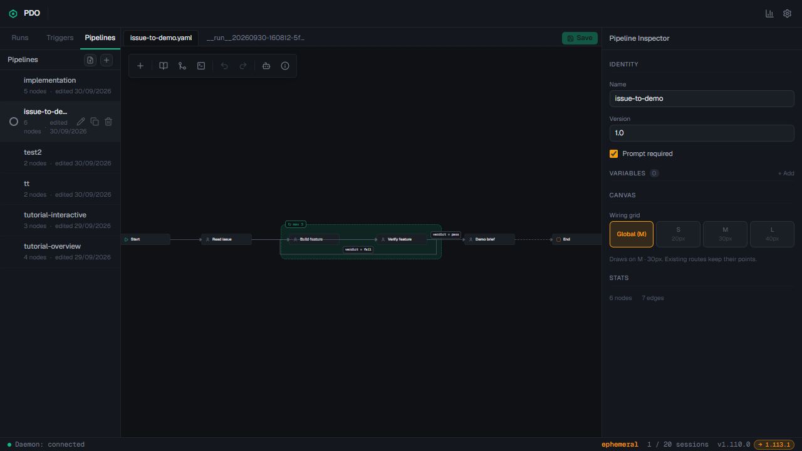

# 4. Create and adapt pipelines

A **pipeline** defines the steps and handoffs. A **run** is one execution of a pipeline against a repository and prompt. Build or choose the pipeline first; then use **Runs → New Run** to execute it. You can reuse the same pipeline for different issues.

For a full hands-on example that creates a pipeline, chooses Script and Agent nodes, runs it, and opens every result, follow [Build, run, and inspect a pipeline yourself](06-hands-on-pipeline-demo.md). Its [pipeline-building MP4](assets/build-pipeline-demo.mp4) and [run-inspection MP4](assets/run-inspection-demo.mp4) show the real PDO editor and inspectors.

## Fast path: use the example already on this PDO instance

The instance used for this guide already has an **issue-to-demo** pipeline. Open [PDO](http://localhost:5172) → **Pipelines** → **issue-to-demo**. The canvas has six nodes and seven edges:

~~~mermaid
flowchart LR
    S[Start] --> R[Read issue]
    R --> B[Build feature]
    R --> V[Verify feature]
    B --> V
    V -- verdict: fail --> B
    V -- verdict: pass --> D[Demo brief]
    D --> E[End]
~~~

Read issue fetches the GitHub ticket; Build feature edits the code; Verify feature checks the code and reports **pass** or **fail**; a failed review returns to Build feature, at most three iterations; a passed review produces a plain-language demo brief. The initial ticket brief also goes directly to Verify feature so review can compare against the original requirements.

Select each node to see its **Node Inspector**: name, type, harness/model, role prompt, input ports, and output ports. Select an edge to inspect its source, destination, and condition. The library pipeline is editable; select **Save** after making changes. Existing runs keep their own pipeline snapshot.

The pipeline definition and its four role prompts are included in [docs/examples](examples/issue-to-demo.yaml). The copy omits instance-specific skill IDs, so it can be used on another installation with the same harness and GitHub CLI. The example does not push code or alter GitHub issues.

## Build a pipeline in the UI

1. Open **Pipelines → New pipeline**. Enter a unique name, such as **my-issue-pipeline**, and select **Create**.
2. Use the canvas **Add** menu to add agent nodes between **Start** and **End**. Give every node a short job name and a focused role prompt.
3. Select a node and define an **output port** for the Markdown or other artifact it must produce. Inputs on Agent and Script nodes appear from incoming edges; the receiving node gets the exact input paths in its runtime instructions.
4. Drag from the border of the source card onto the target card. The new edge carries the source's first declared output; click the edge to change its **Outputs** selection when needed. For a reviewer, connect both the original requirements and the implementation report.
5. For a pass/fail branch, define a **frontmatter field** on the review output named **verdict**, with allowed values **pass** and **fail**. Add a conditional edge for each value.
6. Put the implementer and reviewer in a **bounded loop**, with a maximum iteration count. This prevents endless retries when the same problem cannot be fixed.
7. Inspect every node prompt and connection, then select **Save**. Run it once on a small issue and read all node outputs before using it for larger work.

You can start with a minimal pipeline (Start → Agent → End) to learn the controls, then add review and a demo brief. For a larger process, add a script node for deterministic checks, an approval or interactive step for human input, and a final report node. Keep external actions such as pushing or closing issues explicit and reviewable.

### What each role prompt should say

A useful prompt names the job, its input, the output artifact to write, the checks required, and what to do when blocked. The example prompts in [issue-to-demo.prompts](examples/issue-to-demo.prompts) tell the issue reader to fetch the actual GitHub issue with **gh**, the implementer to run tests/build, the reviewer to inspect code independently and give a structured verdict, and the demo writer to avoid claiming GitHub publication.

PDO injects a runtime preamble with concrete input and output file paths. The agent must write those outputs and call **pdo complete**. If it cannot proceed because it needs your answer, it can call **pdo wait-user**. A node with a missing required output will not complete successfully.

## Import the example on a second PDO installation

The first installation already has this pipeline, so skip this section there. To reproduce it elsewhere, copy the YAML and matching prompt sidecar directory from this repository to the Ubuntu user's PDO pipeline library:

~~~bash
mkdir -p ~/.pdo/pipelines
cp docs/examples/issue-to-demo.yaml ~/.pdo/pipelines/
cp -r docs/examples/issue-to-demo.prompts ~/.pdo/pipelines/
~~~

Run those commands from the root of a checkout containing this documentation. Keep the YAML and **issue-to-demo.prompts** directory together. PDO's pipeline watcher should pick them up; refresh the Pipelines tab. If a pipeline with the same name already exists, back it up or choose a new name before copying. Inspect the imported node prompts in the UI before launching it.

In PDO **v1.110.0**, **New Run** chooses from the instance-wide pipeline library under `~/.pdo/pipelines/`, regardless of which target repository you select. A repository's own `.pdo/pipelines/` folder is not automatically a separate picker for that target. To version a team pipeline with code, keep a reviewed YAML and matching prompts in that repository (as this guide does under `docs/examples/`), then import or copy them into the PDO instance library. Give pipelines clear names so you can pick the right one across projects. See [the multi-repository guide](10-multiple-projects-and-repositories.md) and [PDO's pipeline feature documentation](https://github.com/Loulen/prompt-driven-orchestrator/blob/v1.110.0/docs/features.md#visual-pipelines).

## Verify the design before real work

Ask these questions while looking at the canvas:

- Can the first node actually access the ticket and repository? For this example, **gh auth status** must succeed.
- Does every required input have an incoming edge, and does every agent output have a clear format?
- Can the reviewer compare actual code and tests with the original issue, rather than only with the implementer's summary?
- Does a failure return to an agent that can fix it? Is that loop bounded?
- Is the final output useful to its reader (reviewer, developer, or manager)?
- Are publication steps separate from implementation so a completed run can be inspected before a PR or merge?

## Pipeline vs Trigger vs Run

| Item | Meaning | Example |
| --- | --- | --- |
| Pipeline | Reusable sequence of nodes | issue-to-demo |
| Run | One execution with a target repo and prompt | Implement issue #1 |
| Trigger | Saved rule that starts a run when its condition is met | A scheduled guard check |

For a first issue, create or select a pipeline and launch a run manually. A trigger is optional. A GitHub issue URL in the prompt does **not** by itself create a GitHub webhook or continuous issue sync.
