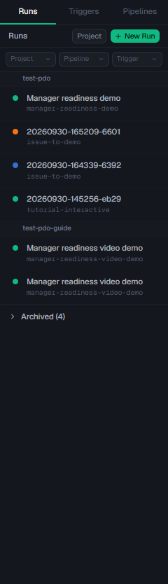
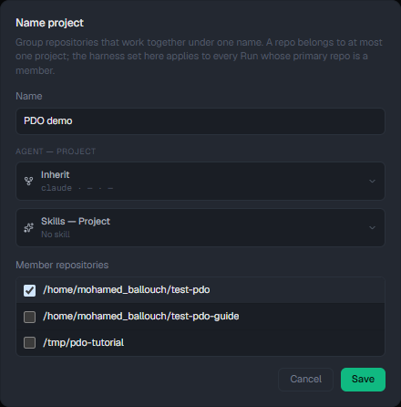
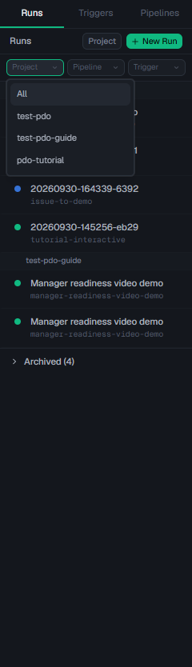
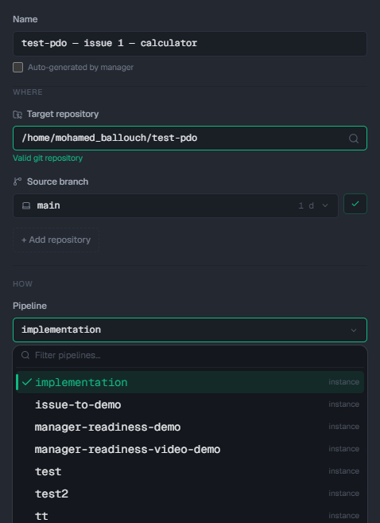
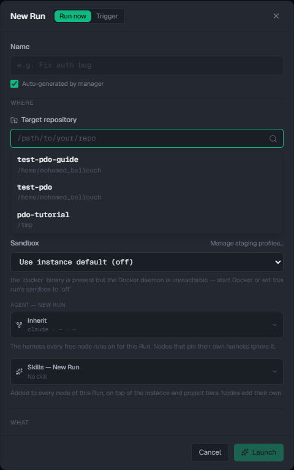
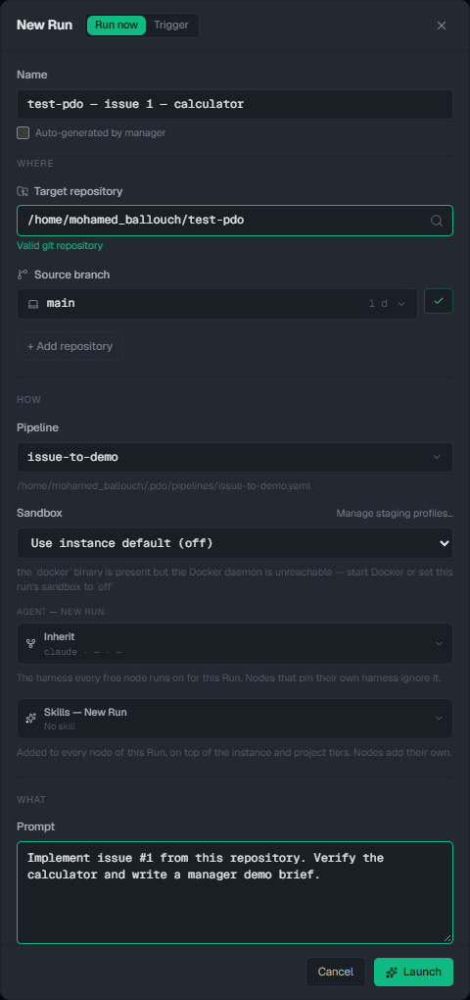
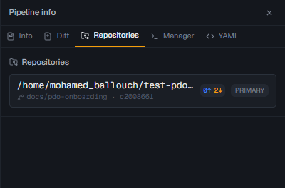
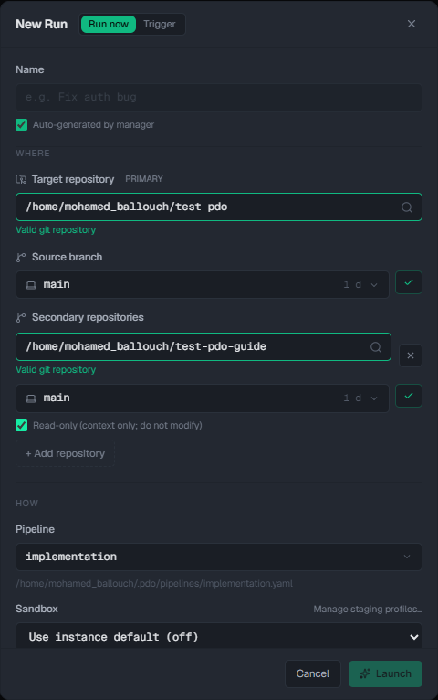

# 10. Work with several projects and repositories

This guide uses **PDO v1.110.0** on your Windows machine with the PDO daemon and Git repositories in **Ubuntu under WSL**. You can keep one PDO daemon for many repositories. You choose the repository for each run; you do not need a separate PDO installation or daemon per project.

For a visual tour, open the [screenshot gallery](multiple-projects.html) in a browser, or use the [local PDO page](http://localhost:5172/pages/pdo-guide/multiple-projects.html) when this repository's docs are mounted.

## The four names to keep separate

| Name in PDO | What it means | Example |
| --- | --- | --- |
| **Project** | A name for one or more related **local repository paths**, with shared agent, skill, and worktree settings | “Manager tools” containing a dashboard and an API |
| **Target repository** | The specific local Git checkout selected when a run starts; this is its **primary** repository | `/home/mohamed_ballouch/manager-dashboard` |
| **Pipeline** | The reusable sequence of steps, such as read ticket → implement → review | `manager-tools-feature-review` |
| **Run** | One execution of a pipeline, with its own target repository, source branch, name, prompt, and result | “Dashboard — export report — ticket MGR-42” |

A Project does **not** clone or connect a GitHub account. It groups paths PDO already knows and supplies defaults to runs whose **primary** repository is a member. A pipeline is not the project: you can reuse the same pipeline on another repository when its prompts and tools make sense there. Every new run must have an explicit target repository. Its Git `origin` remote determines which GitHub repository `git` or `gh` will use for that checkout.

These screenshots show this machine's real PDO interface. `test-pdo` and `test-pdo-guide` are two **local checkouts of the same GitHub repository**; the `client-portal` example below is illustrative. Unrelated repositories appear in the same picker and grouping controls once you clone and use them.

## Example: two unrelated projects

Imagine you have these Ubuntu checkouts:

| Local checkout | GitHub repository | PDO Project | Typical pipeline |
| --- | --- | --- | --- |
| `/home/mohamed_ballouch/test-pdo` | `Mohamedballouch/test-pdo` | “PDO demo” | `issue-to-demo` |
| `/home/mohamed_ballouch/client-portal` | Your portal's remote | “Client portal” | `portal-feature-review` |

You would start a **separate run** for a portal ticket and a PDO demo ticket. In each New Run form, choose the correct target path and source branch, then select a pipeline. Give the run a name that includes the product and ticket. The runs remain separate even when they use the same pipeline.

If your project has a frontend and an API in **two repositories**, you may instead put both paths in one named Project, for example “Manager tools”. That makes a useful visual group and lets both inherit the same agent settings. It does **not** make every run edit both repositories. A normal run still targets one primary repository. Use a multi-repository run only when one piece of work genuinely needs both checkouts; see [one run spanning two repositories](#one-run-spanning-two-repositories) below.

## Step 1 — Prepare each repository in Ubuntu

Clone each code repository into the **same Ubuntu environment and user account** that runs `pdo daemon`. Your existing demo checkout is `/home/mohamed_ballouch/test-pdo`. For another repository, substitute its real URL and folder name:

~~~bash
cd ~
git clone https://github.com/OWNER/REPOSITORY.git client-portal
git -C ~/client-portal remote -v
git -C ~/client-portal status --short --branch
~~~

Use `pwd` inside each checkout to get the absolute path for PDO. An Ubuntu PDO daemon needs Ubuntu paths such as `/home/mohamed_ballouch/client-portal`, not `C:\...` or a browser's GitHub URL. Set your Git author name/email once in Ubuntu, as shown in [Install and connect](01-install-and-connect.md#step-5--clone-and-identify-your-repository). Your Claude Code and `gh` sign-ins are also in that Ubuntu user; each repository's Git remote is separate.

Keep repository paths stable. PDO's Project membership refers to the saved path, so moving or re-cloning a repository elsewhere means you must choose or attach the new path. Before launching work on a new clone, check its `origin`, current branch, and your access to its issue or ticket.

## Step 2 — Give related repositories a Project name

1. Open [PDO](http://localhost:5172) and select **Runs**.
2. Select **Project** beside **New Run**. If that button is not shown yet, start by choosing a repository in **New Run**; PDO's project editor draws its choices from known local repository paths. When runs are grouped, you can also hover a group heading and select its pencil icon.
3. Enter a clear name, such as **PDO demo** or **Manager tools**.
4. Under **Member repositories**, tick the **absolute Ubuntu paths** that belong to that project. One repository path can belong to at most one named Project. Make separate Projects for unrelated clients or products.
5. Optionally choose the project's **Agent**, **Skills**, or **Configure worktree provisioning**. Leave them inherited if the instance defaults already work.
6. Save. The Runs list shows the named Project as a group heading. Hover the heading and select the pencil to rename it or change its member paths later.

The screenshot shows the choice **before Save**; it did not change the existing PDO Projects.

**How to distinguish runs:** use descriptive run names, for example `Portal — MGR-42 — export report` and `PDO demo — issue 1 — calculator`. The Runs list can group by named Project or, for unassigned repositories, by path. Its **Project** filter selects an underlying repository path; use it with **Pipeline** and **Trigger** filters when a group contains several repositories. The run's **Info** and **Repositories** tabs show the actual target path after launch.

## Step 3 — Choose a pipeline for each type of work

Open **Pipelines** to create, duplicate, or inspect a workflow. A pipeline describes **how** work proceeds, not a fixed GitHub repository. A general `feature-review` pipeline can be reused on several repositories if its prompts say to use the selected run's checkout and Git remote. A pipeline with portal-specific build commands or review rules deserves its own clearly named copy, such as `portal-feature-review`. The [pipeline guide](04-pipelines.md) shows how to create and inspect the nodes.

The New Run pipeline menu is the **instance-wide** library, stored in `~/.pdo/pipelines/`; select the workflow appropriate for the repository. Naming conventions help prevent choosing the wrong one. Putting repositories in different Projects does not create separate pipeline libraries or automatically assign a pipeline.

For a manager-facing demo, a practical separation is:

| Workflow | Repository | What to show |
| --- | --- | --- |
| Readiness check | `test-pdo` | Node reports, tests, final brief; no source edits |
| Feature delivery | `client-portal` | Ticket brief, implementation, reviewer result, changed files |

## Step 4 — Launch two clearly identified runs

Repeat these steps for each repository:

1. Select **Runs → New Run**. Turn off **Auto-generated by manager** if you want to type a precise run name. Include the project/repository and ticket in that name.
2. Under **Where → Target repository**, choose the **Ubuntu clone**. The field can suggest recent repositories or let you browse for a Git folder. Wait for **Valid git repository**.
3. Select **Source branch**. Read the field each time you switch repositories; branches can differ, and PDO must start from the branch you intend. Use the branch sync control if you need to check newer remote commits.
4. Under **How → Pipeline**, select the matching workflow. Under **What → Prompt**, describe the exact ticket or task. The ticket key or URL is input for a ticket-reading node, as explained in [GitHub issue to run](03-github-issue-to-run.md) and [Jira ticket inputs](09-jira-and-ticket-integration.md#do-i-need-to-paste-a-link-every-time).
5. Check **target path, source branch, pipeline, name, and prompt** together, then select **Launch**. Repeat with the other repository only when you have a separate task for it.

The filled New Run screenshot is an example only; it was **not launched**.

PDO makes an isolated run worktree and branch under the chosen target repository. In the run canvas, open each node's Inputs, Outputs, and Terminal. Open **Info** for the source branch and run statistics, **Repositories** for the exact primary and secondary paths, **Diff** to review changes, and **YAML** to see the pipeline used. Review the result before publishing a branch or PR. Different run rows and names keep work for separate repositories easy to find.

## One run spanning two repositories

Use this only for a single ticket that crosses repositories, such as changing an API and its dashboard client together. A multi-repository run has **one primary** target repository and one or more **secondary** repositories. The repository list belongs to the **run**, not to the pipeline or Project. PDO snapshots each secondary at a selected branch/commit for the nodes to use. Secondary repositories are **writable by default**; tick **Read-only (context only; do not modify)** when a node merely needs to inspect another codebase.

1. In **Runs → New Run**, choose the repository that owns the main change as **Target repository** and choose its source branch.
2. Select **+ Add repository**. Pick the second Ubuntu checkout and its base branch. Tick **Read-only** if it supplies context only.
3. Give the run a name and prompt that state what should happen in **each** repository. For example: `Manager tools — MGR-42 — API and dashboard`; ask the agent to change the API and dashboard together, run each repository's checks, and report each repository's changed files separately.
4. Launch and open the run's **Repositories** tab. Confirm the **PRIMARY** path and each secondary's **WRITABLE** or **READ-ONLY** badge, branch, and pinned commit. During a live run, you can add or remove a secondary there; this affects nodes launched **after** the change, not nodes already running.
5. Inspect every node. Review the primary **Diff** and check each writable secondary's changes and delivery separately. PDO's automatic run merge-back concerns the **primary repository only**. A completed run does **not** automatically push or open a coordinated PR across repositories. If a secondary is writable, the pipeline's agent must commit and publish its changes deliberately; changes left only in its temporary snapshot may be lost during cleanup. Use a PR in each affected GitHub repository when publishing the work.

This screenshot is the **New Run form before launch**. The run's **Repositories** tab is where you verify the pinned snapshots after launch.

For a first multi-repository demonstration, make the second repository **Read-only** and ask the agent to explain how the two repositories interact. After that succeeds, try a writable secondary on a small branch and inspect both Git histories before cleaning up the run. The [PDO multi-repository reference](https://github.com/Loulen/prompt-driven-orchestrator/blob/v1.110.0/docs/features.md#multi-repo-runs) covers the feature.

## Quick answers

**Do I need one PDO daemon per repository?** No. Keep one daemon in Ubuntu and select a local target repository for each run.

**Should every repository be in a Project?** No. Projects are useful names and shared defaults. An unassigned repository can still be a run target; PDO labels it by its path in the Runs list.

**Does a Project make all member repositories change in one run?** No. The primary target is selected on each run. Add secondary repositories to that run only when its work spans them.

**Can a pipeline be reused?** Yes. Reuse a repository-neutral pipeline; make a dedicated copy when its prompts or checks are specific to one codebase. Projects do not automatically assign a pipeline.

**What if I picked the wrong repository?** Do not rely on the run name to correct it. Read **Target repository** before launch and **Repositories/Info** after launch. A run's primary repository cannot be changed mid-run; start a new run on the correct checkout.

Continue with [pipeline creation](04-pipelines.md), [the run inspection demo](06-hands-on-pipeline-demo.md), and [the general PDO configuration guide](07-pdo-functional-and-configuration-guide.md).
